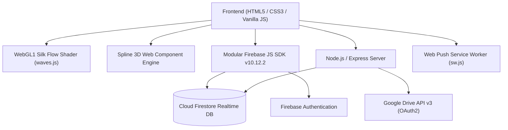
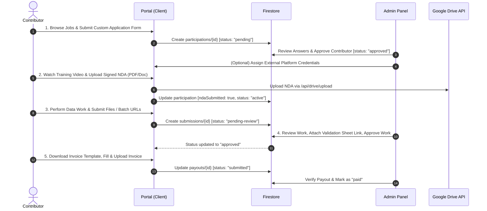
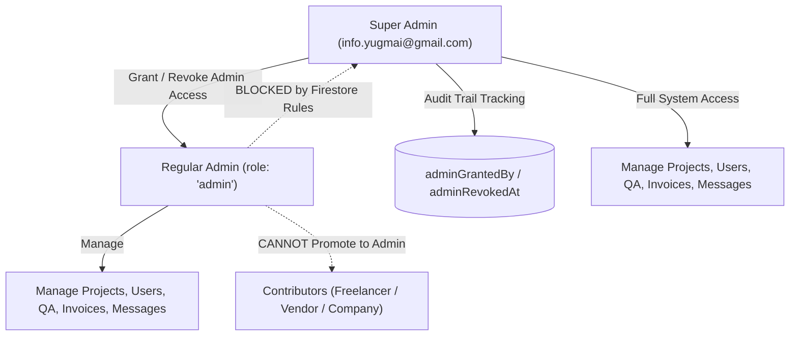

# YUGM AI — Complete Website Architecture, Technical Specification & System Documentation

**Project Name:** YUGM AI  
**Repository:** [https://github.com/infoyugmai-maker/Yugmai](https://github.com/infoyugmai-maker/Yugmai)  
**Website URL:** [https://yugmai.in/](https://yugmai.in/)  
**Headquarters:** Delhi, India (Serving Global AI Enterprises)  
**Document Classification:** Master System Architecture & Technical Manual  

---

## Table of Contents
1. [Executive Summary & Brand Identity](#1-executive-summary--brand-identity)
2. [Technology Stack & Architectural Principles](#2-technology-stack--architectural-principles)
3. [Visual Effects, 3D Models & Animation Engineering](#3-visual-effects-3d-models--animation-engineering)
4. [Complete Page-by-Page Specifications](#4-complete-page-by-page-specifications)
5. [Contributor 5-Step Pipeline Lifecycle](#5-contributor-5-step-pipeline-lifecycle)
6. [Admin & Super Admin Governance System](#6-admin--super-admin-governance-system)
7. [Dynamic Custom Form Builder (11 Field Types)](#7-dynamic-custom-form-builder-11-field-types)
8. [Firestore Database Schema & Data Models](#8-firestore-database-schema--data-models)
9. [Firestore Security Rules & Privilege Protection](#9-firestore-security-rules--privilege-protection)
10. [Backend Express API & Google Drive Integration](#10-backend-express-api--google-drive-integration)
11. [Web Push Notifications & In-App Alerts](#11-web-push-notifications--in-app-alerts)
12. [AI Chatbot (UMAI) & Floating Action Shortcuts](#12-ai-chatbot-umai--floating-action-shortcuts)
13. [File Tree & Codebase Map](#13-file-tree--codebase-map)
14. [Deployment & Environment Configuration](#14-deployment--environment-configuration)

---

## 1. Executive Summary & Brand Identity

YUGM AI is a precision-driven AI training data operations company. It connects global AI researchers and enterprises with a managed network of **10,000+ contributors, vendors, and agencies** across **100+ languages**. The platform handles the entire lifecycle of data collection, audio recording, speech segmentation, NLP annotation, transcription, multi-layer quality assurance, and automated contributor payouts.

### 1.1 Brand Aesthetics & Color System
The visual language reflects precision, computational authority, and modern glassmorphic depth.

*   **Primary Deep Backgrounds:**
    *   `--ink`: `#060606`
    *   `--ink-2`: `#0d0d0d`
    *   `--ink-3`: `#151515`
*   **Brand Purple Accents (Gradient Core):**
    *   Deep Night: `#02010A`
    *   Midnight Indigo: `#04052E`
    *   Royal Purple: `#3D2C8D`
    *   Lavender Glow: `#916BBF`
*   **Typography:**
    *   Primary Font: `Outfit` (Weights: 400, 500, 600, 700, 800) loaded via Google Fonts.
    *   Monospace Font: `JetBrains Mono` / `Consolas` for keys, credentials, and IDs.
*   **Glassmorphism Tokens:**
    *   `backdrop-filter: blur(24px)`
    *   Surface Gradients: `linear-gradient(180deg, rgba(30, 20, 50, 0.45), rgba(15, 10, 30, 0.65))`
    *   Border Highlights: `1px solid rgba(145, 107, 191, 0.2)`
*   **Strict Rule:** No childish emojis are permitted across the production UI. All visual indicators use crisp, scalable SVGs (Heroicons / Lucide design language).

---

## 2. Technology Stack & Architectural Principles



*   **Frontend Core:** Vanilla HTML5, modern CSS3 (Custom Properties, Flexbox, Grid), and pure ES6+ JavaScript. No bloated frontend framework (React/Vue/Angular) is required, ensuring sub-second load times.
*   **Firebase Architecture (Modular ES SDK):**
    *   Loaded via ES Module imports (`import("https://www.gstatic.com/firebasejs/10.12.2/...")`).
    *   Bridged into non-module scripts via synchronous global promises (`window._firebaseReady`).
    *   Zero WebChannel offline blocking bugs.
*   **3D WebGL / Canvas Pipeline:** Real-time GPU fragment shader (`waves.js`) + Spline 3D Viewer Web Component (`@splinetool/viewer@1.9.3`).
*   **Backend Services (`server/index.js`):**
    *   Node.js + Express.js
    *   Google APIs Client Library (`googleapis`) for automated Google Drive folder generation, video/NDA uploads, and shareable permission management.
    *   `web-push` library for VAPID push broadcasts.

---

## 3. Visual Effects, 3D Models & Animation Engineering

### 3.1 GPU Silk Flow Shader Background (`public/js/waves.js`)
The entire platform features a real-time GPU-rendered Silk shader background that runs continuously without degrading DOM performance.
*   **Pipeline:** Fullscreen WebGL1 fragment shader attached to `#hero-waves` canvas (`position: fixed; z-index: -1`).
*   **Mathematical Concept:**
    *   Simulates organic fluid cloth flow using multi-frequency coordinate deformation and trigonometric warping.
    *   Perceptual color rendering utilizes the **Oklab color space** to ensure transitions between YUGM AI's deep purples (`#02010A`, `#04052E`, `#3D2C8D`, `#916BBF`) do not create muddy gray artifacts.
*   **Uniform Parameters:**
    *   `u_scene`: Resolution, dynamic time step, color count.
    *   `u_shape`: Wave scale (`1.2`), intensity, coordinate warp factors.
    *   `u_surface`: High-detail contrast (`1.15`), brightness (`0.85`), saturation (`1.35`).
    *   `u_transform`: Seed variation, rotational drift vectors.
*   **Resilience:** Automatically throttles frame rendering when tab is inactive, and falls back gracefully on low-power devices.

### 3.2 Spline 3D Interactive Robot Model
*   **Scene Endpoint:** `https://prod.spline.design/kZDDjO5HuC9GJUM2/scene.splinecode`
*   **Web Component:** `<spline-viewer>` loaded dynamically via ESM.
*   **Camera & Aspect Ratio Framing (`.hero-robot-box`):**
    *   Configured with an exact aspect ratio of `1.15 / 1`.
    *   This ratio dynamically informs the 3D scene camera to maintain a wide FOV, ensuring the robot's hands are never cropped while neatly terminating the model's thighs at the lower border for a clean glass-frame effect.
*   **Shadow DOM Watermark Purge:** Custom JavaScript loops poll the shadow root to remove the `Built with Spline` badge (`#logo`), ensuring a 100% white-label corporate experience.

### 3.3 Card Mouse-Tracking Spotlight Glow (`public/js/spotlight.js`)
*   Every `.service-card`, `.project-card`, `.process-card`, `.ops-card`, and `.feature-card` registers pointer coordinate listeners.
*   Updates dynamic CSS variables `--glow-x` and `--glow-y` on `mousemove`.
*   A radial gradient pseudo-element (`::before`) follows the user's cursor across the surface with smooth opacity transitions (`--glow-opacity`).

### 3.4 Circular 3D Arc Capabilities Carousel (`public/js/carousel.js`)
*   Located in the `#capabilities` section of the homepage.
*   **Arc Mathematics:** Cards are plotted along a 3D elliptical curve:
    $$\text{offset} = i - \text{activeIndex}$$
    $$X = \sin\left(\text{offset} \cdot \frac{\pi}{5}\right) \times 240\text{px}$$
    $$Y = \left(1 - \cos\left(\text{offset} \cdot \frac{\pi}{5}\right)\right) \times 80\text{px}$$
    $$\text{Scale} = 1 - |\text{offset}| \times 0.12$$
    $$\text{Opacity} = 1 - |\text{offset}| \times 0.35$$
*   **Features:** Auto-rotates every 4,000ms, pauses on mouse hover, supports touch dragging, and renders active numeric progress (`01 of 06`) with clickable pagination dots.

### 3.5 Intersection Observer Scroll-Reveal Engine
*   All major elements carry the `[data-reveal]` attribute.
*   Triggers CSS transitions using `cubic-bezier(0.16, 1, 0.3, 1)` when elements enter 14% of the viewport.
*   Supports staggered cascade delays (`delay-1`, `delay-2`, `delay-3`).

### 3.6 Easing Cubic Number Counter Animation
*   Homepage telemetry metrics (`10,000+ Resources`, `150+ Projects`, `100+ Languages`) animate from `0` to their target numbers on scroll.
*   Driven by a custom cubic ease-out function: $f(t) = (t - 1)^3 + 1$.

---

## 4. Complete Page-by-Page Specifications

| Page | File | Primary Purpose & Key Features |
|---|---|---|
| **Homepage** | `public/index.html` | Hero 3D showcase, Live Projects feed from Firestore, Services grid, Interactive Ops Console, Capabilities Carousel, Partner strip, About preview, and Lead Capture footer. |
| **Contributor Portal** | `public/portal.html` | Contributor command center. Includes the 5-step Project Pipeline, live work submission, Drive upload review, validation sheet access, invoice generation, profile CV management, and support chat. |
| **Admin Panel** | `public/admin.html` | Full enterprise control center with 12 modular tabs: Overview, Projects CRUD + Form Builder, Participation, Work Tracking, Registrations, Messages, Contacts, Sign-in Logs, Announcements, Invoicing, Languages Dashboard, and Super Admin Access. |
| **Job Board** | `public/jobs.html` | Public listing of active and upcoming projects with real-time keyword search, work-type filters, language badges, and direct application routing. |
| **Job Application** | `public/job-apply.html` | Dynamic application engine that renders custom forms built by admins (11 field types), handles uploads, and checks contributor sign-in state. |
| **About Us** | `public/about.html` | Corporate narrative, founding vision (Ahad Ansari & Shamad Ansari), Delhi operations base, security posture, and data methodology. |
| **Contact** | `public/contact.html` | Client inquiry portal for enterprises requesting AI training datasets, speech corpus collection, or custom annotations. |
| **Login** | `public/login.html` | Dual-mode authentication (Email/Password & Google OAuth popup + redirect fallback). Intelligent route forwarding via `?next=` parameter. |
| **Register** | `public/register.html` | Multi-role onboarding for **Freelancers**, **Vendors**, and **Companies** with CV uploads, language resource counters, and skill tags. |
| **Privacy Policy** | `public/privacy.html` | Comprehensive GDPR / Indian IT Act compliant privacy policy, data retention schedules, and contributor rights. |
| **Terms of Service** | `public/terms.html` | Binding contributor contracts, confidentiality obligations, IP assignment, and payout conditions. |
| **Prototype Sandbox** | `public/prototype.html` | Isolated experimental staging area for upcoming UI components. |

---

## 5. Contributor 5-Step Pipeline Lifecycle

Every contributor (Freelancer, Vendor, Company) progresses through a strictly monitored 5-step operational pipeline managed in `public/js/portal.js`:



1.  **Step 1: Application & Screening** — User browses active projects, fills out the project's specific dynamic application form. Admin reviews custom answers and marks status as `approved` (and optionally assigns external credentials).
2.  **Step 2: Onboarding & Compliance** — Contributor watches the embedded training video and uploads their signed Non-Disclosure Agreement (NDA). The file is securely transmitted to Google Drive.
3.  **Step 3: Work Production & Submission** — Contributor submits recorded audio batches, transcripts, or completed volume metrics with Google Drive links and task notes.
4.  **Step 4: Multi-Layer QA & Validation** — Admin audits the submission. Admin can approve, reject, or request revisions. Once approved, the admin attaches the validation evaluation sheet.
5.  **Step 5: Invoicing & Payment** — Once work is validated, the contributor downloads the auto-formatted YUGM AI Invoice template, uploads their filled invoice, and tracks disbursement status through `Submitted` $\rightarrow$ `Paid`.

---

## 6. Admin & Super Admin Governance System

The platform features a **two-tier administrative security architecture**:



### 6.1 Super Admin (`info.yugmai@gmail.com`)
*   The sole account authorized to grant or revoke administrative rights.
*   Accesses the exclusive **🔐 Admin Access Tab** (`data-panel="admin-access"`).
*   Can search any registered user by email and elevate them to `Admin` with a single click.
*   Can revoke administrative rights, instantly demoting users back to `Freelancer`.
*   All elevation and revocation actions write immutable audit logs: `adminGrantedBy`, `adminGrantedAt`, `adminRevokedBy`, `adminRevokedAt`.

### 6.2 Regular Admin (`role: "admin"`)
*   Has full operational access across Projects, Submissions, QA, User Registrations, Support Messaging, Broadcast Announcements, and Invoices.
*   **Security Barrier:** Cannot promote users to admin or modify other admin profiles. Enforced both in the UI and cryptographically by Firestore Security Rules.

### 6.3 Admin Panel Tabs Breakdown
1.  **Overview:** Real-time metrics counters for Total Registrations, Vendor/Company ratios, Active Workflows, Total Submissions, Unique Speakers, and Contact Inquiries.
2.  **Projects:** Create, edit, pause, restart, and delete projects. Contains the **Custom Application Form Builder**, Drive video/NDA link bindings, payout rates, and guidelines links.
3.  **Participation:** Filter join requests by `Interested`, `Pending`, `Approved`, `Rejected`. View custom form answers (with embedded media) and assign external platform login credentials.
4.  **Work Tracking:** Audit contributor submissions. Review Drive links, log hours, approve work, reject, or request revisions with detailed reviewer notes.
5.  **Registrations:** Searchable user directory with detailed user cards (experience, bio, CV download, language counts) and role modifier.
6.  **Messages:** Two-way real-time customer support chat with unread notification badges.
7.  **Contacts:** Inbound enterprise lead manager.
8.  **Sign-in Logs:** Security access audit trail tracking IP address, User-Agent, login method (`google` / `email`), and timestamps.
9.  **Announcements:** In-app notification dispatcher + Web Push notification broadcaster to target audiences (`all`, `freelancer`, `vendor`, `company`, or specific user ID).
10. **Payments & Invoicing:** Manage ended project payouts, review uploaded invoices, approve payment, or flag for corrections.
11. **Languages Dashboard:** Real-time aggregator mapping global language capacity across individual speakers, vendor teams, and agency pools.
12. **Admin Access (Super Admin Only):** Elevation, revocation, and security audit directory.

---

## 7. Dynamic Custom Form Builder (11 Field Types)

Located in `public/js/admin.js`, this tool allows admins to create unique application questionnaires for every project without writing code:

| # | Field Type | Rendered UI Element & Validation |
|---|---|---|
| 1 | `short-text` | Single-line text input for names, IDs, or short phrases. |
| 2 | `long-text` | Multi-line textarea for motivation, experience summaries, or domain knowledge. |
| 3 | `number` | Numeric input with optional min/max validation for age, speed (WPM), or years of experience. |
| 4 | `date` | Date picker for availability or certification dates. |
| 5 | `dropdown` | Custom `<select>` dropdown with admin-specified choices. |
| 6 | `multiple-choice` | Radio button group for single-option selection. |
| 7 | `file-upload` | File attachment input with Google Drive direct upload for voice samples, certificates, or test files. |
| 8 | `section` | Visual card separator for multi-part forms. |
| 9 | `header` | Distinct $H_3$ section title. |
| 10 | `image` | Admin-embedded visual instruction or reference image. |
| 11 | `video` | Admin-embedded training or instruction video. |

---

## 8. Firestore Database Schema & Data Models

### 8.1 `users/{uid}`
```json
{
  "name": "Arfat Ansari",
  "email": "contributor@example.com",
  "phone": "+91 9876543210",
  "companyName": "Apex Data Labs",
  "role": "freelancer", // "admin" | "freelancer" | "vendor" | "company"
  "registeredVia": "google", // "google" | "email"
  "bio": "Specialized in Hindi and Urdu speech annotation.",
  "experience": "3+ years in ASR transcription",
  "languages": ["Hindi", "Urdu", "English"],
  "languageResources": [
    { "language": "Hindi", "count": 25 },
    { "language": "Urdu", "count": 10 }
  ],
  "skills": ["Audio Segmentation", "Phonetic Labeling"],
  "cvUrl": "https://drive.google.com/file/d/...",
  "cvName": "resume_2026.pdf",
  "adminGrantedBy": "info.yugmai@gmail.com",
  "adminGrantedAt": "Timestamp",
  "createdAt": "Timestamp",
  "updatedAt": "Timestamp"
}
```

### 8.2 `projects/{projectId}`
```json
{
  "name": "Indic Voice Corpus Collection",
  "workType": "Data Recording",
  "status": "active", // "active" | "upcoming" | "ended"
  "submissionPlatform": "internal", // "internal" | "external"
  "requiresCredentials": true,
  "description": "High-fidelity recording across 12 regional dialects.",
  "languages": ["Hindi", "Bengali", "Marathi"],
  "teamSize": 50,
  "deadline": "2026-12-31",
  "payoutTerms": "Per Valid Hour",
  "payoutRate": "₹800 / hour",
  "externalLink": "",
  "guidelinesLink": "https://drive.google.com/...",
  "trainingVideo": "https://drive.google.com/...",
  "ndaLink": "https://drive.google.com/...",
  "customForm": [
    { "id": "f1", "type": "short-text", "label": "Native Dialect", "required": true }
  ],
  "createdAt": "Timestamp",
  "updatedAt": "Timestamp"
}
```

### 8.3 `participations/{participationId}`
```json
{
  "projectId": "proj_123",
  "userId": "user_456",
  "userName": "Arfat Ansari",
  "userEmail": "contributor@example.com",
  "status": "approved", // "interested" | "pending" | "approved" | "rejected"
  "ndaSubmitted": true,
  "ndaFileUrl": "https://drive.google.com/...",
  "assignedCredentials": "apex_worker_04 / TempPass2026",
  "formAnswers": {
    "Native Dialect": "Bhojpuri Hindi"
  },
  "createdAt": "Timestamp",
  "updatedAt": "Timestamp"
}
```

### 8.4 `submissions/{submissionId}`
```json
{
  "projectId": "proj_123",
  "userId": "user_456",
  "driveUrl": "https://drive.google.com/drive/folders/...",
  "hours": 12.5,
  "notes": "Completed Batch 04 - 50 speakers recorded.",
  "status": "approved", // "pending-review" | "approved" | "rejected" | "revision-needed"
  "adminFeedback": "Excellent acoustic quality. Validation sheet attached.",
  "validationSheetUrl": "https://docs.google.com/spreadsheets/d/...",
  "createdAt": "Timestamp",
  "updatedAt": "Timestamp"
}
```

### 8.5 `payouts/{payoutId}`
```json
{
  "projectId": "proj_123",
  "userId": "user_456",
  "status": "paid", // "pending_request" | "requested" | "submitted" | "paid"
  "invoiceUrl": "https://drive.google.com/...",
  "invoiceFileName": "YUGMAI_INV_089.pdf",
  "rejectionReason": "",
  "paidAt": "Timestamp",
  "createdAt": "Timestamp"
}
```

### 8.6 `messages/{threadId}` & `messages/{threadId}/items/{itemId}`
*   `threadId` is the contributor's `userId`.
*   `unreadAdmin`: Number of messages waiting for Admin review.
*   `unreadUser`: Number of messages waiting for Contributor review.
*   Items subcollection: `{ senderId, senderName, text, timestamp }`.

### 8.7 `signinLogs/{logId}`
```json
{
  "userId": "user_456",
  "name": "Arfat Ansari",
  "email": "contributor@example.com",
  "role": "freelancer",
  "method": "google",
  "ip": "103.21.124.89",
  "userAgent": "Mozilla/5.0 (Windows NT 10.0; Win64; x64)...",
  "createdAt": "Timestamp"
}
```

---

## 9. Firestore Security Rules & Privilege Protection

The `firestore.rules` file enforces strict server-side authorization:

```javascript
rules_version = '2';

service cloud.firestore {
  match /databases/{database}/documents {

    function isSignedIn() {
      return request.auth != null;
    }

    // Ultimate security boundary: Only info.yugmai@gmail.com is Super Admin
    function isSuperAdmin() {
      return isSignedIn()
        && request.auth.token.email != null
        && request.auth.token.email.lower() in ['info.yugmai@gmail.com'];
    }

    function isAdmin() {
      return isSuperAdmin()
        || (isSignedIn()
            && exists(/databases/$(database)/documents/users/$(request.auth.uid))
            && get(/databases/$(database)/documents/users/$(request.auth.uid)).data.role == 'admin');
    }

    function isOwner(uid) {
      return isSignedIn() && request.auth.uid == uid;
    }

    // User Profile Rules: Prevents Privilege Escalation
    match /users/{uid} {
      allow read: if isOwner(uid) || isAdmin();
      allow create: if isOwner(uid)
        && (request.resource.data.role != 'admin' || isSuperAdmin());
      allow update: if
        // Owner can update profile but CANNOT self-promote to admin
        (isOwner(uid) && (request.resource.data.role != 'admin' || isSuperAdmin()))
        // Super Admin has full update authority
        || isSuperAdmin()
        // Regular Admins can manage users BUT:
        // 1. CANNOT promote anyone to admin
        // 2. CANNOT demote/modify existing admins
        || (isAdmin()
            && resource.data.role != 'admin'
            && request.resource.data.role != 'admin');
      allow delete: if isAdmin();
    }

    match /projects/{id} {
      allow read: if true;
      allow write: if isAdmin();
    }

    match /participations/{id} {
      allow read: if isAdmin() || (isSignedIn() && resource.data.userId == request.auth.uid);
      allow create: if isSignedIn() && request.resource.data.userId == request.auth.uid;
      allow update: if isAdmin() || (isSignedIn() && resource.data.userId == request.auth.uid);
      allow delete: if isAdmin();
    }

    match /submissions/{id} {
      allow read: if isAdmin() || (isSignedIn() && resource.data.userId == request.auth.uid);
      allow create: if isSignedIn() && request.resource.data.userId == request.auth.uid;
      allow update: if isAdmin() || (isSignedIn() && resource.data.userId == request.auth.uid);
      allow delete: if isAdmin();
    }

    match /payouts/{id} {
      allow read: if isAdmin() || (isSignedIn() && resource.data.userId == request.auth.uid);
      allow write: if isAdmin();
    }

    match /messages/{threadId} {
      allow read, write: if isOwner(threadId) || isAdmin();
      match /items/{itemId} {
        allow read, create: if isOwner(threadId) || isAdmin();
        allow update, delete: if isAdmin();
      }
    }

    match /contacts/{id} {
      allow read, update, delete: if isAdmin();
      allow create: if false; // Server Admin SDK only
    }

    match /notifications/{id} {
      allow read: if isSignedIn();
      allow write: if isAdmin();
    }

    match /signinLogs/{id} {
      allow read: if isAdmin();
      allow create: if isSignedIn() && request.resource.data.userId == request.auth.uid;
      allow update, delete: if isAdmin();
    }
  }
}
```

---

## 10. Backend Express API & Google Drive Integration

Located in `server/index.js` and `server/driveService.js`, this Node service runs in support of the frontend:

*   **Google Drive Service:** Automatically manages folder structures for:
    *   `Training Videos/`
    *   `NDAs/`
    *   `CVs & Resumes/`
    *   `Submissions/`
    *   `Invoices/`
*   **Authentication:** Authenticated via OAuth2 Refresh Tokens with auto-rotating access tokens.
*   **Permissions:** Dynamically assigns `anyoneWithLink: viewer` permissions to uploaded assets so admins and contributors can view media seamlessly.
*   **Endpoints:**
    *   `POST /api/drive/upload`: Accepts `multipart/form-data` uploads, streams directly to Google Drive, and returns public view and download links.
    *   `POST /api/contact`: Validates enterprise contact submissions and persists them securely.
    *   `POST /api/push/send`: Broadcasts VAPID web push notifications to subscribed service workers.

---

## 11. Web Push Notifications & In-App Alerts

*   **Service Worker (`public/sw.js`):** Intercepts background push payloads, displaying native desktop and mobile push notifications with custom click actions.
*   **Notification Bell UI (`public/js/auth.js`):**
    *   Dynamically injected into every portal and header.
    *   Listens in real-time to the `notifications` collection filtered by user role.
    *   Displays unread badge counts and provides an in-app interactive modal reading pane.

---

## 12. AI Chatbot (UMAI) & Floating Action Shortcuts

*   **UMAI Chatbot:** An intelligent assistant widget floating on the public website (`Ask UMAI`).
    *   Assists visitors with inquiries regarding data services, workflow onboarding, contributor guidelines, and contact routes.
    *   Features quick-action query pills and smooth stream typing simulation.
*   **Floating Action Button (FAB):** Bottom-right action pill offering quick access to `Request Plan` (Contact) and `Work With Us` (Register).

---

## 13. File Tree & Codebase Map

```text
Yugmai-main/
├── .firebaserc                          # Firebase project linkage (yugmai)
├── .gitignore                           # Excludes node_modules, IDE, and local configs
├── firebase.json                        # Firebase hosting configuration
├── firestore.rules                      # Server-side security & Super Admin rules
├── storage.rules                        # Cloud storage rules
├── WEBSITE_ARCHITECTURE_AND_FULL_SPECIFICATION.md # Master System Documentation
│
├── public/                              # Production Client Directory
│   ├── index.html                       # Homepage (3D Robot, Live Projects, Services)
│   ├── portal.html                      # Contributor Portal (5-Step Pipeline)
│   ├── admin.html                       # Admin & Super Admin Panel (12 Tabs)
│   ├── jobs.html                        # Public Job Board
│   ├── job-apply.html                   # Dynamic Custom Application Form
│   ├── about.html                       # About Us & Company Profile
│   ├── contact.html                     # Enterprise Lead Intake Form
│   ├── login.html                       # User Sign-In (Email + Google Auth)
│   ├── register.html                    # User Sign-Up (Freelancer / Vendor / Company)
│   ├── privacy.html                     # Privacy Policy
│   ├── terms.html                       # Terms of Service & Vendor Agreement
│   ├── prototype.html                   # Component Testing Sandbox
│   ├── sitemap.xml                      # Search engine index map
│   ├── robots.txt                       # Crawler guidelines
│   ├── sw.js                            # Web Push Service Worker
│   │
│   ├── css/
│   │   ├── style.css                    # Master Stylesheet & Design Tokens
│   │   └── jobs.css                     # Job Board Specific Layouts
│   │
│   ├── js/
│   │   ├── firebase-config.js           # Modular Firebase SDK initializer
│   │   ├── auth.js                      # Authentication, Super Admin, Push & Bells
│   │   ├── script.js                    # UI interactions, UMAI bot, Live project loader
│   │   ├── waves.js                     # WebGL1 GPU Silk Flow Shader
│   │   ├── spotlight.js                 # Mouse-tracking radial card glow
│   │   ├── carousel.js                  # 3D Arc capabilities carousel
│   │   ├── portal.js                    # Contributor dashboard logic
│   │   ├── admin.js                     # Admin & Super Admin dashboard logic
│   │   ├── jobs.js                      # Jobs board dynamic filter logic
│   │   ├── job-apply.js                 # Dynamic form renderer & submission engine
│   │   ├── login-page.js                # Login page handler
│   │   ├── register-page.js             # Registration handler
│   │   └── contact.js                   # Contact form handler
│   │
│   └── docs/                            # Internal specs, PDFs, and legal drafts
│
└── server/                              # Node.js / Express Backend
    ├── index.js                         # API server & Push Notification dispatcher
    ├── driveService.js                  # Google Drive API v3 integration
    ├── package.json                     # Backend dependencies
    └── .env.example                     # Environment template
```

---

## 14. Deployment & Environment Configuration

### 14.1 Local Development
To run the static frontend locally:
```powershell
Set-ExecutionPolicy -Scope Process -ExecutionPolicy Bypass
npx -y serve public -l 60688
```
*Note: All job application URLs are linked via clean parameters (`job-apply?jobId=...`) to avoid local server redirect stripping.*

To run the backend Express service:
```powershell
cd server
npm install
npm start
```

### 14.2 Production Deployment
1.  **Firestore Security Rules:**
    ```bash
    firebase deploy --only firestore:rules
    ```
2.  **Frontend & Hosting:**
    ```bash
    firebase deploy --only hosting
    ```
3.  **Git Version Control:**
    ```bash
    git add -A
    git commit -m "update: release notes"
    git push -u origin main
    ```

---
*Documentation compiled and verified for YUGM AI Enterprise Systems.*
